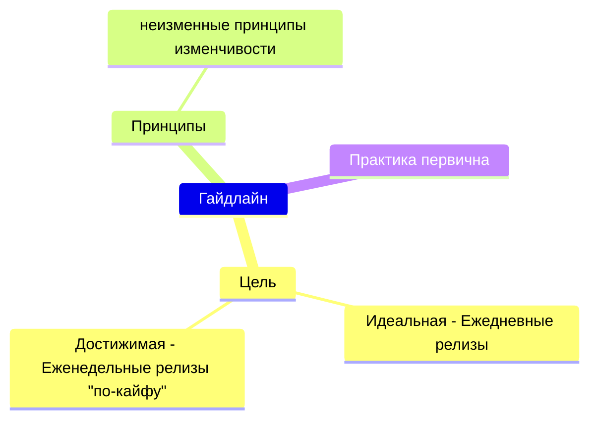
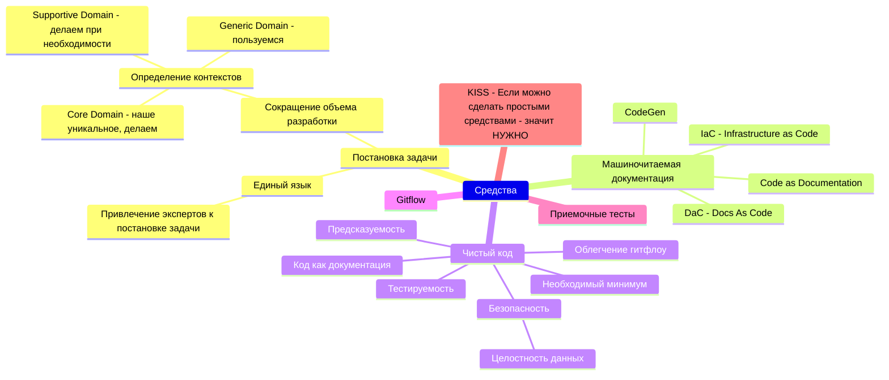
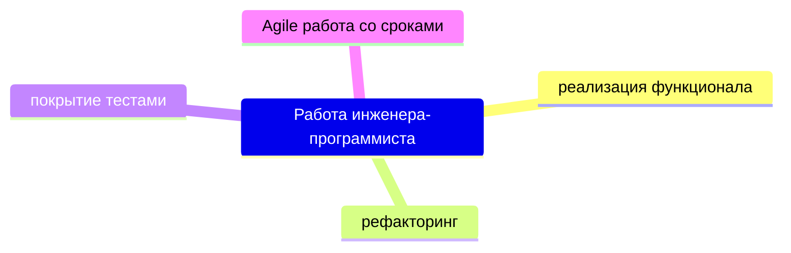

```mermaid
mindmap
Гайдлайн
    Цель
        Идеальная - Ежедневные релизы
        Достижимая - Еженедельные релизы "по-кайфу"
    Принципы
        неизменные принципы изменчивости

    Практика первична
```

```mermaid
mindmap
Средства
    Постановка задачи
        Единый язык
            Привлечение экспертов к постановке задачи
        Сокращение объема разработки
            Определение контекстов
                Core Domain - наше уникальное, делаем
                Supportive Domain - делаем при необходимости
                Generic Domain - пользуемся
    
    Машиночитаемая документация
        DaC - Docs As Code
        CodeGen
        Code as Documentation
        IaC - Infrastructure as Code
            
    Чистый код
        Тестируемость
        Предсказуемость
        Код как документация
        Необходимый минимум
        Безопасность
            Целостность данных
        Облегчение гитфлоу
    
    Gitflow
    
    Приемочные тесты
    KISS - Если можно сделать простыми средствами - значит НУЖНО 


```

```mermaid
mindmap
    Работа инженера-программиста
        реализация функционала
        рефакторинг
        покрытие тестами
        Agile работа со сроками
```
