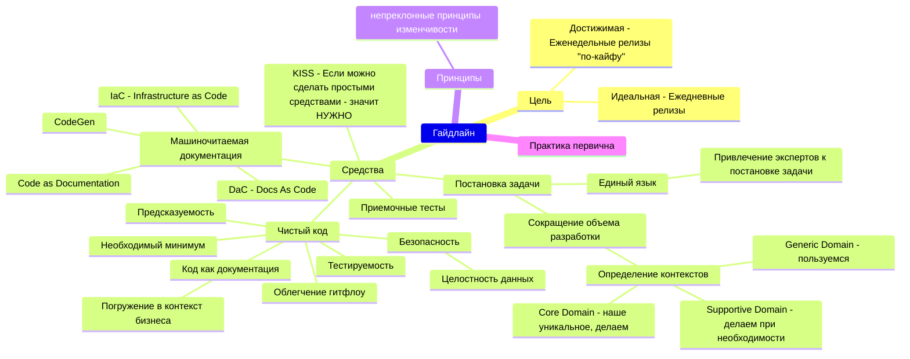

```mermaid
mindmap
    Гайдлайн
        Цель
            Идеальная - Ежедневные релизы
            Достижимая - Еженедельные релизы "по-кайфу"
        Средства
            Постановка задачи
                Единый язык
                    Привлечение экспертов к постановке задачи
                Сокращение объема разработки
                    Определение контекстов
                        Core Domain - наше уникальное, делаем
                        Supportive Domain - делаем при необходимости
                        Generic Domain - пользуемся
            
            Машиночитаемая документация
                DaC - Docs As Code
                CodeGen
                Code as Documentation
                IaC - Infrastructure as Code
                    
            Чистый код
                Тестируемость
                Предсказуемость
                Код как документация
                    Погружение в контекст бизнеса
                Необходимый минимум
                
                Безопасность
                    Целостность данных
                Облегчение гитфлоу
                    
            Приемочные тесты
            KISS - Если можно сделать простыми средствами - значит НУЖНО 

        Принципы
            непреклонные принципы изменчивости
            

        Практика первична
```