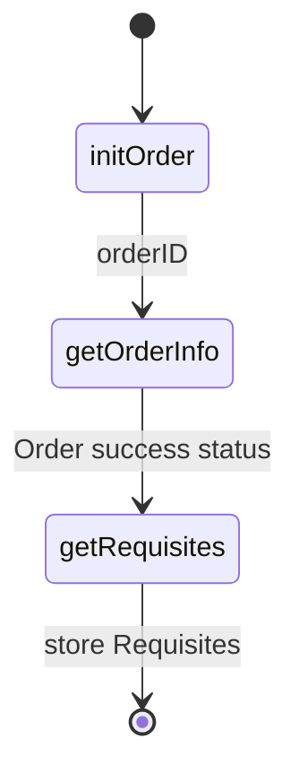
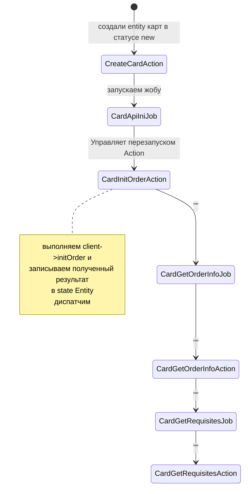

# Интеграция с API. Contract, Client, Action, Job, State

пример - внешнее API выпуска кредитной карты, 
для завершения процесса требует три API вызова на три разных endpoint.
1. Инициализация заказа на выпуск карты
2. Получение статуса успешности заказа
3. Получение реквизитов

1. Для каждого endpoint создаём контракты
2. Создаем  Client для API с песочной версией
3. Добавляем нашу Domain Entity (Модель), с ValueObject для накопления состояния, приходящего от API
4. Добавляем Action's,  которые будут использовать Client и сохранять полученное от Client состояние в Domain Entity
5. Добавляем Job's , которые будет управлять процессом перезапуска Action в случаях сбоя внешнего API

Итоговая схема
