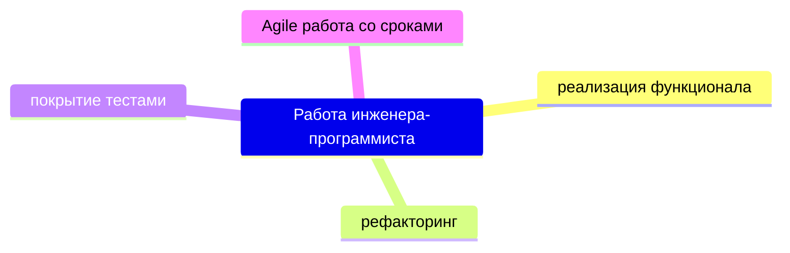

# Делаем soft мягким

# Цель

Еженедельные релизы нового функционала 

https://martinfowler.com/bliki/CodeAsDocumentation.html

Что вы не найдете в этом гайдлане:
Исходные условия для гайды.

здесь нет 
- инструкций как установить гит, докер, композер и т.п., 
- аргументации зачем нужны юнит тесты, CI/CD, структурированный код 
- нет юнит, feature, workflow, e2e, приемочные тесты
нет интерпретации архитектурных подходов, DDD, В
тут нет требований о необходимости foreignKeys в миграциях, это вы и так знаете.

это не документация Laravel, 
вы уже знаете что такое Eloquent, Request, Response, Http::fake, 
и Laravel сьюит для написания тестов. 

нет объяснений разницы доменных, интеграционных, 

аргументов о необходимости inbox и outbox очередей

Мы работаем со специалистами, вы способны к самообучению, 

Гайдлайн написан для инженеров и в нём используются термины.  
Если тебе какие-то термины не знакомы. 
Не теряйся, спроси значение у коллег.  

Глупых вопросов не бывает.  
Не знать - не стыдно. Стыдно - не развиваться.

работа инженера-программиста состоит из 

Принцип соблюдения гайдлайна

1. Гайдлайн - это ориентир, а не догма.
2. Гайдлан - это не тюрьма.
3. За несоблюдение гайдлайна вас не убьют.
4. Неизменность базовых принципов позволяет софту быть изменчивым.
5. Обозначение рамок позволяет творчески проявить себя в деталях. 
6. Практика первична. Задача должна быть закрыта. В срок. И покрыта тестами. 
7. Чувствуй себя в коде как дома. Видишь в структуре кода возможность улучшения - проводи рефакторинг.   